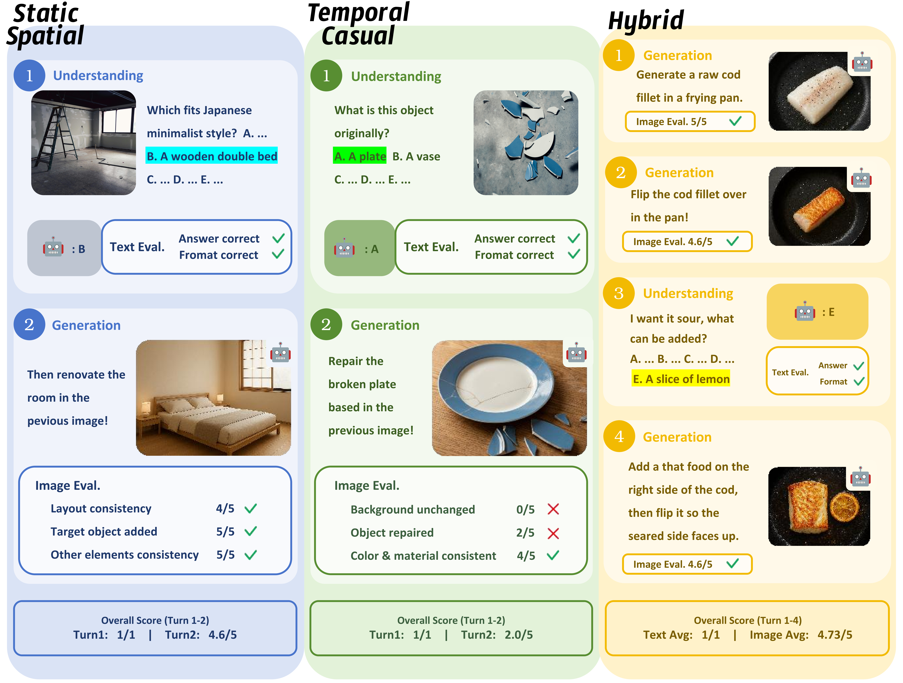
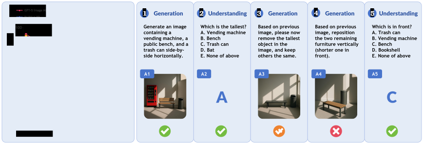

<div align="center">

# IMUG-Bench: Benchmarking Unified Multimodal Models on Interleaved Understanding and Generation

**Lingyi Meng<sup>*1</sup>, Zecong Tang<sup>*†1</sup>, Haoran Li<sup>*1</sup>, Tengju Ru<sup>*1</sup>, Zhejun Cui<sup>1</sup>, Weitong Lian<sup>1</sup>, Qi Kang<sup>1</sup>, Hangshuo Cao<sup>1</sup>, Yichen Zhu<sup>1</sup>, Yechi Liu<sup>3</sup>, Kaixuan Wang<sup>2</sup>, Yu-Jie Yuan<sup>4</sup>, Chunwei Wang<sup>4</sup>, Yu Zhang<sup>‡1</sup>, Bo Dai<sup>‡2</sup>**

<sup>1</sup>Zhejiang University &nbsp; <sup>2</sup>The University of Hong Kong &nbsp; <sup>3</sup>Institute of Automation, Chinese Academy of Sciences &nbsp; <sup>4</sup>Huawei

<sup>*</sup>Equal contribution &nbsp; <sup>†</sup>Project leader &nbsp; <sup>‡</sup>Corresponding author

[](https://arxiv.org/abs/2606.09169)
[](https://github.com/ccccEsion/IMUG-Bench)
[](#license)

[Paper](https://arxiv.org/abs/2606.09169) | [Dataset](#dataset) | [Evaluation](#quickstart) | [Results](#results--analysis)

</div>

<p align="center">
  
</p>

## Overview

IMUG-Bench is a benchmark for **interleaved multimodal understanding and generation** in multi-turn image-text dialogue. It evaluates whether unified multimodal models can answer questions, generate or edit images, preserve relevant visual context, and reason about model-specific outcomes as a conversation evolves.

Unlike benchmarks that evaluate understanding and generation separately or rely on static, single-turn questions, IMUG-Bench evaluates both capabilities in a shared multi-turn protocol. It includes dynamic questions whose ground-truth answers depend on the evaluated model's own earlier outputs.

### Key Facts

- **Scale:** 3,113 samples and 12,034 interaction turns.
- **Coverage:** 19 domains and 97 fine-grained tasks.
- **Dialogue length:** 2 to 6 interleaved text and image output turns per sample.
- **Task types:** static MCQ, dynamic MCQ, and image generation or editing.
- **Score analysis:** all modalities, text-only, image-only, domain, class, and turn-wise results.

### Contributions

- We introduce a large-scale benchmark for jointly evaluating understanding and generation in multi-turn interleaved dialogue.
- We include dynamic MCQs that resolve their reference answers from a model's earlier generated content, rather than treating every answer as fixed.
- We provide point-based image evaluation with historical visual references for instruction following and cross-turn consistency.
- We characterize generation-side exposure bias in longer interactions and study test-time scaling strategies for mitigating it.

## Benchmark Structure

IMUG-Bench organizes multi-turn image-text dialogue into three complementary task classes.

### Task Classes

- **Static Spatial:** evaluates target-element attributes, ownership, and spatial relations.
- **Temporal Causal:** evaluates implicit natural laws and common-sense causal reasoning in context.
- **Hybrid:** combines spatial and causal requirements in diverse everyday scenarios.

### Interleaved Task Protocol

Each sample contains an ordered sequence of turns. At every turn, the model must return either text or an image; subsequent turns may depend on preceding inputs and model outputs.

| Task Type | Model Output | Evaluation |
| --- | --- | --- |
| Static MCQ | Answer letters | Direct answer and format scoring |
| Dynamic MCQ | Answer letters | A judge first resolves the context-dependent reference answer from referenced prior turns, then applies MCQ scoring |
| Image Generation | Generated or edited image | A judge scores each evaluation point from 0 to 5, using historical image references when needed |

For an image turn with $N$ evaluation points, the normalized turn score is the mean point score divided by 5. Text scores and image scores are both converted to percentages in the final summary.

## Dataset

The released data contains benchmark metadata, input images, reference links for image and dynamic evaluation, and grid ground truth for deterministic geometric-coloring scoring.

### Repository Layout

```text
data/
  benchmark.jsonl             # Benchmark samples and turn metadata
  images/                     # Input images
  image_references.jsonl      # Reference-image links for image scoring
  dynamic_references.jsonl    # Referenced turns for dynamic MCQ resolution
  grid_gt/                    # Ground truth for geometric coloring
config/
  domain_classes.json         # Paper-defined class-to-domain mapping
scripts/
  run_evaluation.py           # Interactive end-to-end scoring runner
  auxiliary/
    common.py                 # Shared path, validation, and I/O helpers
    resolve_dynamic_answers.py # Dynamic MCQ answer resolution
    score_image.py            # Judge-based image scoring
    score_grid.py             # Deterministic geometric-coloring scoring
    score_mcq.py              # Static and dynamic MCQ scoring
    summarize_results.py      # Percentage-based result summaries
    dynamic_prompt.txt        # Dynamic-answer judge prompt
    eval_prompt.txt           # Image-scoring judge prompt
```

### Data Format

`data/benchmark.jsonl` is JSONL. Every record contains a domain, subdomain, sample identifier, and ordered `tasks`. Each task contains its `turn`, expected output `modality`, inputs, and either an MCQ answer or image evaluation points.

Model outputs must follow this layout:

```text
outputs/model_outputs/<model>/<domain>/<subdomain>/question_<sample_id>/
  result.json
  turn_<turn>_output.png
```

`result.json` stores per-turn text responses in its `tasks` list. Image turns are read from `turn_<turn>_output.png`; image filenames referenced from `result.json` are also supported by the image scorer.

Scoring artifacts are separated by evaluated model:

```text
outputs/<model>/
  dynamic_answer/<model>_dynamic_answer.jsonl
  score_img/<model>_img_score.jsonl
  score_mcq/<model>_mcq_score.jsonl
  summary/
```

The supporting scorers, prompts, and shared helpers are kept under `scripts/auxiliary/`; they are normally invoked through `run_evaluation.py`.

## Results & Analysis

The benchmark supports separate analysis of understanding and generation, together with domain-level and turn-wise reporting. The paper finds that image-generation scores can decline as dialogue context grows, exposing the difficulty of maintaining requirements and visual consistency across turns.

<p align="center">
  
</p>

<p align="center"><em>Image-modality trends across dialogue turns and a representative multi-turn interaction.</em></p>

IMUG-Bench spans three classes and 19 domains. The benchmark composition is summarized below; detailed per-domain, per-class, and per-turn reports are produced by `summarize_results.py`.

<p align="center">
  
</p>

<p align="center"><em>Class and domain composition of IMUG-Bench.</em></p>

## Quickstart

### 1. Install Dependencies

```bash
pip install -r requirements.txt
```

### 2. Run the Full Scoring Workflow

Place one or more model-output directories under `outputs/model_outputs/`, then run:

```bash
python scripts/run_evaluation.py
```

On first use, the runner asks for a judge API base URL, API key, judge model, and model-output directory. These values are stored only in `config/local_config.json`, which is excluded from version control. The workflow runs dynamic-answer resolution, image scoring, deterministic grid scoring, and MCQ scoring in order.

If `--model-output-dir` itself contains the domain folders for one model, pass that model name with `--model`; the runner creates a temporary alias and keeps the original model outputs unchanged.

To update the local configuration:

```bash
python scripts/run_evaluation.py --reconfigure
```

### 3. Run an Offline Pipeline Check

No API key is required for a structural smoke test. The evaluation runner validates the selected model-output directory, starts a temporary localhost OpenAI-compatible random judge server, and runs the standard dynamic-answer and image-scoring clients against it. Results are written to `outputs/smoke_test/<model>/`.

```bash
python scripts/run_evaluation.py --smoke-test --models <model> --seed 2026
```

Use `--smoke-port <port>` to select the local server port; the default `0` selects an available port automatically.

`--model` is an alias for a single evaluated model directory name. If the selected path itself is the model root and directly contains domain folders, it can be used as follows:

```bash
python scripts/run_evaluation.py \
  --smoke-test \
  --model bageltest \
  --model-output-dir ../BAGEL/
```

The runner creates a temporary local alias for this layout and leaves the original model outputs unchanged.

### 4. Summarize Results

```bash
python scripts/auxiliary/summarize_results.py --models <model>
```

For a single model, the summary is written by default to `outputs/<model>/summary/summary.md` and `outputs/<model>/summary/summary.json`. When summarizing multiple models together, it is written to `outputs/summary/`. The repository includes the paper-defined class mapping in `config/domain_classes.json`, which is loaded automatically. Use `--class-config` only when applying a custom mapping:

```bash
python scripts/auxiliary/summarize_results.py \
  --models <model> \
  --class-config config/domain_classes.json
```

## Citation

```bibtex
@article{meng2026imugbench,
  title={IMUG-Bench: Benchmarking Unified Multimodal Models on Interleaved Understanding and Generation},
  author={Meng, Lingyi and Tang, Zecong and Li, Haoran and Ru, Tengju and Cui, Zhejun and others},
  journal={arXiv preprint arXiv:2606.09169},
  year={2026}
}
```

## License

The license for code and data is being finalized for the public release.

## Contact

Please open a GitHub issue for questions about the benchmark or evaluation code.
